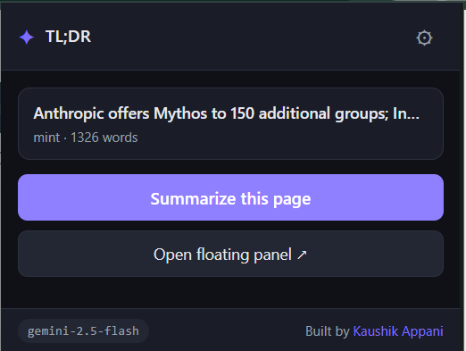
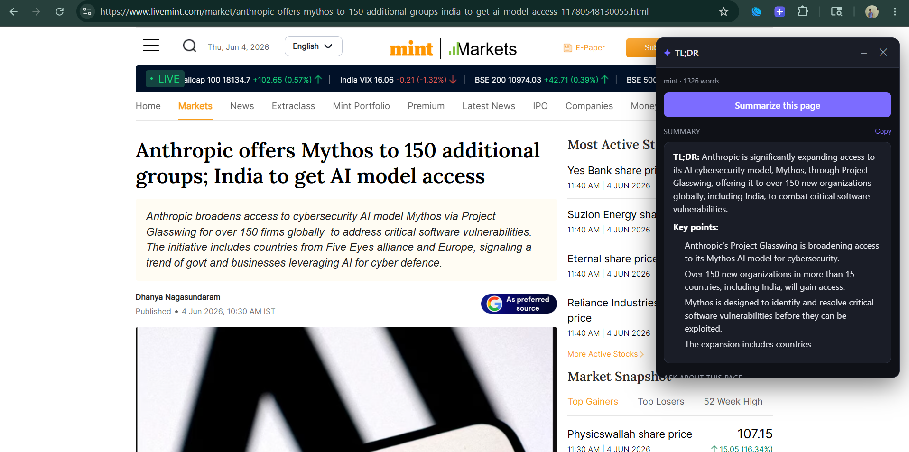

<div align="center">

# ✦ TL;DR

### Read less, understand more.

A Chrome extension that summarizes any web page or news article and lets you **ask questions about it** — powered by Google Gemini.


</div>

---

##  Features

-  **Two AI providers** — use **Google Gemini** or **Groq** (Llama 3.3, GPT-OSS). Pick one in Settings; switch anytime.
-  **One-click summary** — instant TL;DR + key takeaways for any page.
-  **Works on PDFs too** — summarize and question online *or* local PDFs. Text is extracted locally with pdf.js, so it works with either provider (scanned/image-only PDFs aren't supported).
-  **Ask questions** — chat with the page; answers are grounded in its actual content, with conversation history.
-  **Right-click menu** — *"Summarize this page"* anywhere, or *"Summarize selection"* on highlighted text.
-  **Floating panel** — a draggable, minimizable panel that lives on the page, so you never lose your place when you click away.
-  **Smart extraction** — pulls the real article body and skips nav, ads, comments, and clutter.
-  **Model picker** — choose the model per provider (Gemini Flash/Pro, or Groq Llama/GPT-OSS).
-  **Private by design** — your API key stays in your browser; page content goes only to your chosen AI provider. No tracking, no servers.

---

##  Screenshots


| Popup | Floating panel |
|-------|----------------|
|  |  |

---

##  Installation (unpacked)

The extension isn't on the Chrome Web Store yet — load it manually in a minute:

1. **Clone or download** this repo:
   ```bash
   git clone https://github.com/kaushikappani/tldr.git
   ```
   _(or click **Code → Download ZIP** and unzip it)_
2. Open **`chrome://extensions`** in Chrome (or `edge://extensions` in Edge).
3. Turn on **Developer mode** (top-right toggle).
4. Click **Load unpacked** and select the project folder.
5. Pin the extension, then click its icon → ⚙ **Settings**.
6. Paste your **Gemini API key** (see below), pick a model, click **Test connection**, then **Save**. 

###  Get a free Gemini API key

1. Go to **[Google AI Studio → API Keys](https://aistudio.google.com/app/apikey)**.
2. Click **Create API key** and copy it.
3. Paste it into the extension's Settings. The free tier is plenty for everyday use.

###  Summarizing local PDFs (optional)

To summarize PDFs opened from your computer (`file://…`), turn on **Allow access to file URLs**
for this extension in `chrome://extensions` → **Details**. Web PDFs (`http(s)://…`) work without it.

---

##  Usage

| How | What |
|-----|------|
| **Toolbar popup** | Click the icon → **Summarize this page / PDF** → ask questions or use the suggestion chips. |
| **Floating panel** | Popup → **Open floating panel ↗**, or right-click the page → **Summarize this page**. Drag by the header; **–** minimizes, **✕** closes. |
| **Selection** | Highlight text → right-click → **Summarize selection** (summarizes just that text). |
| **PDFs** | Open any PDF and click the toolbar icon → **Summarize this PDF**. _(Use the popup for PDFs — the floating panel/right-click aren't available inside Chrome's PDF viewer.)_ |

>  The toolbar **popup** always closes when you click the page — that's how Chrome popups work. Use the **floating panel** when you want it to stay open while you read.

---

##  How it works

```
┌─────────────┐     extract      ┌──────────────┐
│  content.js │◀─────────────────│              │
│ (page text) │─────────────────▶│ background.js│
└─────────────┘                  │  (worker)    │
                                 │              │
┌─────────────┐   summarize/ask  │              │     REST     ┌──────────┐
│  popup.js   │◀────────────────▶│              │─────────────▶│  Gemini  │
│  overlay.js │                  │   gemini.js  │◀─────────────│   API    │
└─────────────┘                  └──────────────┘              └──────────┘
```

1. **`content.js`** runs a Readability-style heuristic to extract the main article text (skipping boilerplate).
2. **`background.js`** (service worker) orchestrates extraction, Gemini calls, the right-click menus, and injecting the floating panel.
3. **`gemini.js`** wraps the Gemini `generateContent` REST API for summaries and grounded Q&A.
4. **`popup.js`** and **`overlay.js`** render the UI and talk to the worker via messages.

---

##  Project structure

| File | Role |
|------|------|
| `manifest.json` | Extension config (Manifest V3) |
| `background.js` | Service worker — extraction, Gemini calls, context menus, overlay injection |
| `gemini.js` | Gemini REST API wrapper (summarize / ask) |
| `content.js` | Readability-style page content extractor |
| `popup.html` · `popup.css` · `popup.js` | Toolbar popup UI |
| `overlay.css` · `overlay.js` | In-page floating panel (markup built in JS) |
| `options.html` · `options.css` · `options.js` | Settings page (API key + model) |
| `icons/` | 16 / 48 / 128 px icons |

---

##  Tech stack

- **Chrome Extensions Manifest V3** (service worker, `chrome.scripting`, `chrome.contextMenus`, `chrome.storage`)
- **Vanilla JavaScript** (ES modules) — no frameworks, no build step
- **Google Gemini API** (`gemini-2.0-flash` by default)

---

##  Privacy

- Your API key is stored only in your browser via `chrome.storage.sync` (synced to your Google account, never sent to any third party).
- Page content is sent **only** to Google's Gemini API to generate summaries and answers.
- There is no analytics, telemetry, or backend server of any kind.

---


##  License

[MIT](LICENSE) — free to use, modify, and share.

---

<div align="center">

Built by **[Kaushik Appani](https://kaushikappani.github.io/portfolio/)**

⭐ If you find this useful, consider starring the repo!

</div>
